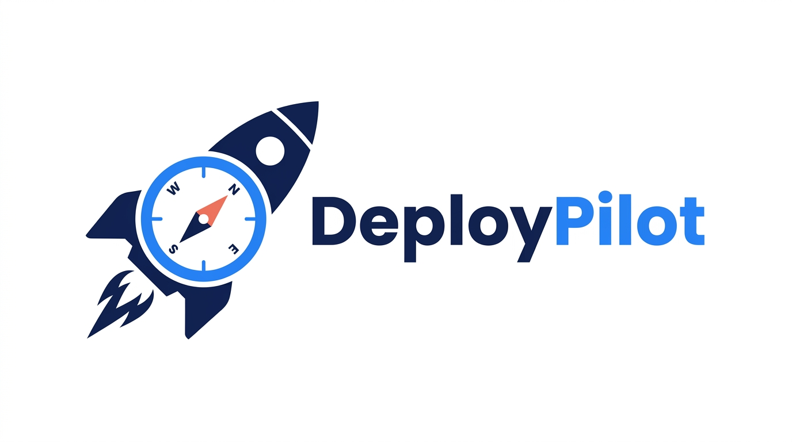

<p align="center"></p>

<h1 align="center">DeployPilot</h1>

<p align="center">
  <strong>AI-Native Deployment Management Platform</strong><br>
  Powered by MCP protocol — drive container deployment, monitoring &amp; self-healing with natural language
</p>

<p align="center">
  <a href="https://github.com/Yogdunana/deploypilot/actions/workflows/ci.yml">
    
  </a>
  <a href="https://github.com/Yogdunana/deploypilot/actions/workflows/docker.yml">
    
  </a>
  
  
  
  
  
</p>

<p align="center">
  <a href="README_zh.md">中文文档</a>
</p>

---

DeployPilot connects AI assistants to your infrastructure through the [Model Context Protocol (MCP)](https://modelcontextprotocol.io/). Manage container deployments, real-time monitoring, automated healing, and multi-cloud DNS directly from AI IDEs like Claude, Cursor, and Windsurf — using natural language.

---

## ✨ Features

### 🤖 AI Integration
- **MCP Server** — 37 tools covering deployment, monitoring, DNS, notifications, and diagnostics with stdio transport
- **REST API** — 68 endpoints with JWT authentication and RBAC access control
- **Swagger Documentation** — Built-in interactive API docs at `/swagger/`
- **Natural Language Operations** — Conversational infrastructure management inside AI IDEs

### 🚀 Deployment Engine
- **Three Deployment Modes** — Direct deploy, Git build, and CI/CD trigger
- **Built-in Builder** — Full pipeline from Git clone to Docker build to container launch
- **Preflight Checks** — SSH connectivity, Docker availability, port conflicts, and TCP reachability validation
- **Health Checks** — HTTP/TCP probes with configurable retry strategies
- **Application Templates** — 9 presets (Node.js, Python, Go, Java, Rust, etc.)
- **Backup & Rollback** — Full container state snapshots with one-click rollback

### 📊 Operations & Monitoring
- **Self-Healing Engine** — Auto-restarts crashed/OOM containers and rolls back after exceeding max restart attempts
- **Monitoring System** — CPU, memory, and disk metrics collection with three-tier alerts (critical/warning/info)
- **Agent Reverse Tunnel** — WebSocket tunnel through NAT, no inbound ports required
- **SSH Terminal** — In-browser terminal powered by xterm.js and WebSocket proxy

### 🔒 Security & Access Control
- **JWT Authentication** — Token-based auth with configurable expiration
- **RBAC** — Four-tier roles (owner > admin > dev > viewer)
- **Credential Encryption** — AES-256-GCM + bcrypt, no plaintext stored in the database
- **Audit Logging** — All mutations recorded with user, action, IP, and timestamp
- **Rate Limiting** — Token bucket algorithm with per-role tiers (50–200 req/min)
- **Security Headers** — X-Content-Type-Options, X-Frame-Options, CSP, Referrer-Policy

### ⚡ Real-Time Communication
- **WebSocket Log Streaming** — Live container log push (`/ws/logs/:app_id`)
- **SSE Deployment Progress** — Server-Sent Events for step-by-step deployment status updates
- **Redis Pub/Sub** — Horizontal scaling support for multi-instance deployments

### 🔌 Service Provider Ecosystem

| Category | Providers |
|----------|-----------|
| **DNS** | Cloudflare, Alibaba Cloud, Tencent Cloud (DNSPod) |
| **Notifications** | Webhook, Email, Telegram, DingTalk, Feishu/Lark |
| **CI/CD** | GitHub Actions |

### 🖥️ Web Management Panel
- **Vue 3 + TypeScript + Tailwind CSS 4** — Modern responsive frontend
- **27 Pages** — Dashboard, app management, server management, DNS, credentials, providers, notifications, templates, deployment history, audit logs, user management, system settings, monitoring & alerts, SSL certificates, CI/CD, and more
- **Real-Time Features** — Live log streaming, SSH terminal, deployment progress bars, metrics polling

---

## 🏗️ Architecture

```
┌─────────────────────────────────────────────────────────────────────┐
│                        Access Layer                                  │
│   MCP Server (stdio)  │  REST API (JWT+RBAC)  │  WebSocket / SSE   │
├─────────────────────────────────────────────────────────────────────┤
│                        Core Engine                                   │
│   App Mgmt │ Credential Mgmt │ DNS │ Deploy Engine │ Notify │ HC    │
│   Backup & Restore │ Monitor & Alert │ Self-Heal │ SSL │ Audit │ RBAC │
├─────────────────────────────────────────────────────────────────────┤
│                        Provider Plugins                              │
│   ServerProvider (SSH) │ DNSProvider (×3) │ NotifyProvider (×5)     │
│   CICDProvider (GitHub) │ TemplateProvider (×9 presets)              │
├─────────────────────────────────────────────────────────────────────┤
│                        Data Layer                                    │
│   SQLite / PostgreSQL  │  Redis (Pub/Sub)  │  File Storage  │ Metrics │
└─────────────────────────────────────────────────────────────────────┘
```

---

## 🚀 Quick Start

### Docker One-Click Deploy (Recommended)

```bash
# Clone the repository
git clone https://github.com/Yogdunana/deploypilot.git
cd deploypilot

# Start the service
docker compose up -d

# Visit http://localhost:8080 and register an admin account to get started
```

> You can also pull the pre-built image directly:
> ```bash
> docker run -d -p 8080:8080 -v deploypilot-data:/app/data ghcr.io/yogdunana/deploypilot:latest
> ```

### Build from Source

**Prerequisites**: Go 1.23+, Node.js 20+

```bash
# 1. Clone and build the frontend
git clone https://github.com/Yogdunana/deploypilot.git
cd deploypilot
cd web && npm ci && npm run build && cd ..

# 2. Build the backend (three binaries)
go build -o deploypilot ./cmd/deploypilot/
go build -o api-server ./cmd/api-server/
go build -o mcp-server ./cmd/mcp-server/

# 3. Or use the Makefile
make build-all
```

### ⚙️ Configuration

```bash
cp configs/config.yaml.example config.yaml
```

Key configuration options:

```yaml
database:
  driver: sqlite          # or postgres
  dsn: ./deploypilot.db

server:
  host: 0.0.0.0
  port: 8080

auth:
  jwt_secret: "your-secret-key"
  token_expiry: 24h

deploy:
  health_check_timeout: 60s
  rollback_on_failure: true

monitor:
  enabled: true
  collect_interval: 30s
```

> All configuration options support override via environment variables with the `DEPLOYPILOT_` prefix. See [DEPLOY.md](DEPLOY.md) for details.

### ▶️ Running

```bash
# API server (REST API + Web panel)
./api-server --config config.yaml

# MCP server (AI IDE integration)
./mcp-server --config config.yaml

# CLI tool
./deploypilot serve --config config.yaml
```

### 🔌 MCP Integration Setup

Add the following to your AI IDE configuration (Claude Desktop, Cursor, Windsurf, etc.):

```json
{
  "mcpServers": {
    "deploypilot": {
      "command": "/path/to/mcp-server",
      "args": ["--config", "/path/to/config.yaml"]
    }
  }
}
```

### 🌐 Reverse Proxy

For production environments, it is recommended to use Nginx or Caddy as a reverse proxy:

```nginx
server {
    listen 443 ssl;
    server_name deploy.example.com;

    location / {
        proxy_pass http://127.0.0.1:8080;
        proxy_set_header Host $host;
        proxy_set_header X-Real-IP $remote_addr;
        proxy_set_header X-Forwarded-Proto $scheme;
    }

    location /ws/ {
        proxy_pass http://127.0.0.1:8080;
        proxy_http_version 1.1;
        proxy_set_header Upgrade $http_upgrade;
        proxy_set_header Connection "upgrade";
    }
}
```

---

## 🔧 MCP Tools

DeployPilot registers **37 MCP tools**, organized by category:

| Category | Tools |
|----------|-------|
| **Deployment** | `deploy_app`, `get_deploy_status`, `rollback_app`, `batch_deploy` |
| **App Management** | `list_apps`, `get_app_detail`, `create_app`, `update_app`, `delete_app` |
| **Server Management** | `list_servers`, `add_server`, `update_server`, `delete_server`, `test_server` |
| **Credential Management** | `list_credentials`, `add_credential`, `update_credential`, `delete_credential` |
| **DNS Management** | `list_dns_records`, `add_dns_record`, `update_dns_record`, `delete_dns_record`, `batch_dns` |
| **Monitoring** | `heal_container`, `get_container_metrics`, `get_system_metrics`, `list_alerts`, `list_alert_rules` |
| **CI/CD** | `trigger_ci_build`, `get_ci_build_status` |
| **Notifications** | `send_notification` |
| **Templates** | `list_templates`, `get_template` |
| **Tasks** | `get_task_status`, `list_tasks` |
| **Diagnostics** | `detect_environment`, `health_check`, `doctor` |

---

## 📡 REST API

The API server exposes **68 endpoints** under `/api/v1/`:

| Resource | Endpoints | Examples |
|----------|-----------|----------|
| **Auth** | 2 | `POST /api/v1/auth/register`, `POST /api/v1/auth/login` |
| **Apps** | 14 | `POST /api/v1/apps`, `POST /api/v1/apps/:id/deploy` |
| **Servers** | 7 | `POST /api/v1/servers`, `POST /api/v1/servers/:id/detect` |
| **Credentials** | 4 | `POST /api/v1/credentials` |
| **DNS** | 4 | `POST /api/v1/dns/records` |
| **Providers** | 4 | `POST /api/v1/providers` |
| **Notifications** | 4 | `POST /api/v1/notifications` |
| **Templates** | 4 | `GET /api/v1/templates` |
| **Users & Roles** | 5 | `GET /api/v1/users`, `PUT /api/v1/users/:id/role` |
| **Audit Logs** | 1 | `GET /api/v1/audit-logs` |
| **System** | 3 | `GET /api/v1/system/health` |
| **Deployments** | 2 | `GET /api/v1/deployments` |
| **Backups** | 2 | `GET /api/v1/apps/:id/backups` |
| **Monitoring** | 6 | `GET /api/v1/monitor/system`, `POST /api/v1/monitor/heal/:name` |
| **CI/CD** | 2 | `POST /api/v1/cicd/trigger` |
| **SSL** | 4 | `GET /api/v1/ssl/certificates` |
| **Real-Time** | 4 | `WS /ws/logs/:app_id`, `WS /ws/terminal/:server_id`, `SSE /sse/deploy/:app_id` |

Visit `/swagger/` after starting the server to view the full interactive API documentation.

---

## 📁 Project Structure

```
deploypilot/
├── cmd/
│   ├── api-server/          # REST API + Web panel entry point
│   ├── deploypilot/         # CLI tool entry point (Cobra)
│   └── mcp-server/          # MCP Server entry point
├── internal/
│   ├── agent/               # Agent reverse tunnel (WebSocket)
│   ├── api/                 # REST API handlers (Gin)
│   ├── auth/                # JWT authentication + RBAC middleware
│   ├── config/              # Configuration management (Viper)
│   ├── crypto/              # AES-256-GCM encryption
│   ├── database/            # Database migrations & seeds (GORMigrate)
│   ├── engine/
│   │   ├── builder/         # Dockerfile templates (9 presets)
│   │   ├── deployer/        # Docker container operations
│   │   ├── detector/        # Environment detection (OS/Docker/ports/services)
│   │   └── healer/          # Self-healing engine
│   ├── mcp/                 # MCP Server & tool registration
│   ├── middleware/           # HTTP middleware (audit, rate limit, security headers)
│   ├── model/               # GORM data models
│   ├── monitor/             # Metrics collection & alerting
│   ├── provider/
│   │   ├── cicd/            # CI/CD (GitHub Actions)
│   │   ├── dns/             # DNS (Cloudflare, Alibaba Cloud, Tencent Cloud)
│   │   ├── notify/          # Notifications (Webhook, Email, Telegram, DingTalk, Feishu)
│   │   ├── registry/        # Container registry (planned)
│   │   └── server/          # SSH client (PTY support)
│   ├── server/              # HTTP server & static file serving
│   └── service/             # Business logic layer (Bridge — 46 methods)
├── web/                     # Vue 3 + TypeScript + Tailwind CSS frontend
│   ├── src/
│   │   ├── api/modules/     # 15 API modules
│   │   ├── components/      # 22 UI components + 8 business components
│   │   ├── composables/     # useWebSocket, useSSE, usePolling
│   │   ├── views/           # 27 page components
│   │   ├── stores/          # Pinia state management
│   │   └── router/          # Vue Router
│   └── embed.go             # Go embed for frontend build artifacts
├── configs/                 # Configuration file templates
├── docs/                    # Swagger docs & MCP tool specifications
├── scripts/                 # Build & deployment scripts
├── tests/e2e/               # End-to-end tests
├── pkg/errors/              # Error handling utilities
├── .github/workflows/       # CI/CD (testing, linting, multi-arch Docker builds)
├── Dockerfile               # Three-stage build (Node → Go → Alpine)
├── docker-compose.yml       # Production deployment
├── docker-compose.dev.yml   # Development environment
├── Makefile                 # 14 build targets
└── go.mod                   # Go module definition
```

---

## 🛠️ Tech Stack

| Layer | Technologies |
|-------|-------------|
| **Backend** | Go 1.23, Gin, GORM, Cobra, Viper |
| **Frontend** | Vue 3.5, TypeScript 5.6, Vite 6, Tailwind CSS 4, Pinia, Radix Vue |
| **Database** | SQLite (default) / PostgreSQL |
| **Cache** | Redis (optional, Pub/Sub for horizontal scaling) |
| **Protocols** | MCP (stdio), REST, WebSocket, SSE |
| **Security** | JWT, AES-256-GCM, bcrypt, RBAC |
| **Deployment** | Docker, Docker Compose, GitHub Actions, GHCR |
| **Testing** | Go testing, golangci-lint, govulncheck |

---

## 💻 Development

### Running Tests

```bash
go test -race -count=1 ./...
```

### Code Quality

```bash
# Lint
golangci-lint run ./...

# Security vulnerability scan
govulncheck ./...

# Run all checks (vet + lint + test)
make check
```

### Coverage

```bash
make coverage
# Generate a visual HTML coverage report
make coverage-html
```

### Swagger Documentation

```bash
make swagger
# Equivalent to: swag init -g cmd/api-server/main.go -o docs/swagger
```

### Makefile Targets

```bash
make build          # Build CLI tool
make build-mcp      # Build MCP Server
make build-api      # Build API Server
make build-all      # Build all binaries
make test           # Run tests (with race detector)
make coverage       # Generate coverage report
make coverage-html  # Generate HTML coverage report
make lint           # Run golangci-lint
make vet            # Run go vet
make check          # vet + lint + test
make swagger        # Generate Swagger documentation
make docker-build   # Build Docker image
make clean          # Clean build artifacts
```

---

## 🗺️ Roadmap

- [ ] MCP context memory (session-level operation history)
- [ ] Container registry management (Docker Hub, GHCR)
- [ ] 1Panel / BT Panel integration
- [ ] Multi-cluster Kubernetes support
- [ ] Prometheus / Grafana metrics export
- [ ] Mobile-responsive layout

---

## 🤝 Contributing

Contributions are welcome! Please follow these steps:

1. Fork this repository
2. Create a feature branch (`git checkout -b feature/my-feature`)
3. Write tests for your changes
4. Ensure `make check` passes (vet + lint + test)
5. Commit using [Conventional Commits](https://www.conventionalcommits.org/) (`feat:`, `fix:`, `docs:`, etc.)
6. Push and open a Pull Request

---

## 📄 License

[MIT](LICENSE) &copy; 2026 Yogdunana
