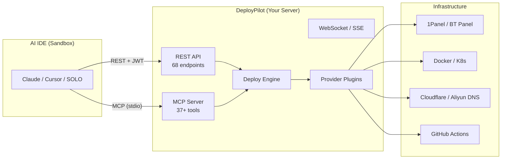

<p align="center">
  
</p>

<h1 align="center">DeployPilot</h1>

<p align="center">
  <strong>The AI-native deployment gateway for your server.</strong><br>
  Bridge the gap between sandboxed AI IDEs and your infrastructure.
</p>

<p align="center">
  <a href="#quickstart"><b>Quickstart</b></a> ·
  <a href="#features"><b>Features</b></a> ·
  <a href="#architecture"><b>Architecture</b></a> ·
  <a href="docs/PRD.md"><b>PRD</b></a> ·
  <a href="#contributing"><b>Contributing</b></a>
</p>

<p align="center">
  
  
  
  
  
  
</p>

---

## The Problem

AI IDEs like **Claude**, **Cursor**, **SOLO**, and **Windsurf** run in cloud sandboxes — they **cannot SSH into your server**. This means AI can't help you with:

- ❌ Deploying applications
- ❌ Allocating ports (3 projects all default to port 5000?)
- ❌ Configuring reverse proxies
- ❌ Managing DNS records
- ❌ Provisioning SSL certificates
- ❌ Opening firewall rules on 1Panel / BT Panel

**DeployPilot solves this.** It runs on your server and exposes a standard **MCP interface** that any AI IDE can call — securely, remotely, and autonomously.

---

## TL;DR

> DeployPilot is a self-hosted deployment gateway that lets sandboxed AI IDEs securely manage your server through the MCP protocol. One-line install, full automation.

---

## Quickstart

### One-line install (recommended)

```bash
curl -fsSL https://raw.githubusercontent.com/Yogdunana/deploypilot/main/scripts/install.sh | bash
```

The script automatically:
- ✅ Downloads the latest binary for your architecture
- ✅ Generates admin credentials (random username + strong password)
- ✅ Configures systemd services (API server + MCP server)
- ✅ Sets up JWT authentication

After installation, open `http://<YOUR_SERVER_IP>:8080` and log in with the printed credentials.

### Docker

```bash
docker run -d --name deploypilot \
  -p 8080:8080 \
  -v deploypilot-data:/app/data \
  ghcr.io/yogdunana/deploypilot:latest
```

### From source

```bash
git clone https://github.com/Yogdunana/deploypilot.git
cd deploypilot && make build-all
```

---

## AI IDE Integration

Configure DeployPilot as an MCP server in your AI IDE:

```json
{
  "mcpServers": {
    "deploypilot": {
      "command": "/opt/deploypilot/bin/mcp-server",
      "args": ["--config", "/opt/deploypilot/config/config.yaml"]
    }
  }
}
```

Then just tell your AI:

> *"Deploy this project, set up DNS and SSL."*

DeployPilot handles the rest — port allocation, reverse proxy, DNS records, SSL certificates, and firewall rules.

---

## Architecture



**Why MCP, not SSH?** AI IDEs live in sandboxes with no SSH capability. MCP is the native AI plugin protocol — DeployPilot speaks it fluently.

---

## Features

### Deployment Engine
| Feature | Description |
|---------|-------------|
| **3 deploy modes** | Direct, Git build, CI/CD trigger |
| **Auto port allocation** | No more port conflicts |
| **Health checks** | HTTP/TCP probes with configurable retries |
| **Backup & rollback** | One-click rollback to any version |
| **Self-healing** | Auto-restart crashed containers, auto-rollback on threshold |
| **App templates** | 9 presets (Node.js, Python, Go, Java, Rust, etc.) |

### AI Integration
| Feature | Description |
|---------|-------------|
| **MCP Server** | 37+ tools, stdio transport, native AI IDE support |
| **REST API** | 68 endpoints, JWT auth + RBAC |
| **Swagger docs** | Interactive API explorer at `/swagger/` |

### Provider Ecosystem
| Category | Providers |
|----------|-----------|
| **DNS** | Cloudflare, Aliyun, Tencent Cloud (DNSPod) |
| **Notifications** | Webhook, Email, Telegram, DingTalk, Feishu |
| **CI/CD** | GitHub Actions, Gitea |
| **Panels** | 1Panel, BT Panel |
| **Containers** | Docker (local + remote), Kubernetes (multi-cluster) |

### Security
| Feature | Description |
|---------|-------------|
| **JWT authentication** | Token-based auth with configurable expiry |
| **RBAC** | 4-tier roles: owner > admin > dev > viewer |
| **Credential encryption** | AES-256-GCM, no plaintext in database |
| **ws-ticket** | One-time WebSocket tickets, prevents JWT leakage |
| **Audit log** | Full change tracking with user, action, IP, timestamp |
| **Rate limiting** | Token bucket, role-based (50-200 req/min) |

### Web Dashboard
- Vue 3 + TypeScript + Tailwind CSS 4
- 27 pages: dashboard, apps, servers, DNS, credentials, deployments, monitoring, SSL, audit log, and more
- Real-time log streaming, SSH terminal, deployment progress
- i18n (English / Chinese), responsive design

---

## Why DeployPilot?

| | DeployPilot | 1Panel / BT | Dokploy / Coolify | AI SSH Clients |
|---|:---:|:---:|:---:|:---:|
| **Web panel** | ✅ | ✅ | ✅ | ❌ |
| **AI-native (MCP)** | ✅ | ❌ | ❌ | ✅ |
| **Full-chain automation** | ✅ | ❌ | Partial | ❌ |
| **One-line install** | ✅ | ✅ | ✅ | ❌ |
| **Port / DNS / SSL** | ✅ | Manual | ✅ | ❌ |
| **Panel integration** | ✅ | — | ❌ | ❌ |

**DeployPilot is the only tool that combines a web panel, AI-native MCP support, and full deployment automation in one self-hosted package.**

---

## Tech Stack

<p>
  
  
  
  
  
  
  
  
  
  
</p>

---

## Roadmap

- [ ] MCP context memory (session-level operation history)
- [ ] Container registry management (Docker Hub, GHCR)
- [ ] Prometheus / Grafana metrics export
- [ ] OAuth login (GitHub / Gitee)
- [ ] Full mobile responsive layout
- [ ] More DNS / notification providers

---

## Contributing

Contributions are welcome! Please read [docs/CONTRIBUTING.md](docs/CONTRIBUTING.md) for guidelines.

## License

[MIT](LICENSE) © 2026 Yogdunana
