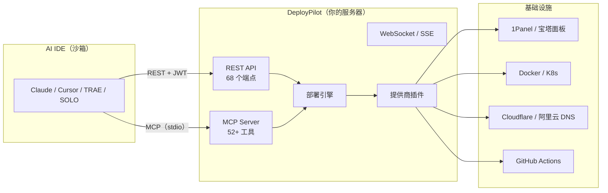

<p align="center">
  
</p>

<h1 align="center">DeployPilot</h1>

<p align="center">
  <strong>AI 原生部署网关 — 连接沙箱 AI IDE 与你的服务器基础设施</strong><br>
  让云端沙箱中的 AI 安全地管理你的服务器部署。
</p>

<p align="center">
  <a href="#快速开始"><b>快速开始</b></a> ·
  <a href="#核心功能"><b>核心功能</b></a> ·
  <a href="#架构"><b>架构</b></a> ·
  <a href="docs/PRD.md"><b>PRD</b></a> ·
  <a href="#参与贡献"><b>参与贡献</b></a>
</p>

<p align="center">
  
  
  
  
  
  
</p>

---

## 面临的挑战

AI IDE（如 **Claude**、**Cursor**、**SOLO**、**TRAE**、**扣子/Coze**）运行在云端沙箱环境中 — 它们 **无法直接 SSH 到你的服务器**。这意味着 AI 无法帮你完成以下操作：

- ❌ 部署应用程序
- ❌ 分配端口（3 个项目都默认使用 5000 端口？）
- ❌ 配置反向代理
- ❌ 管理 DNS 记录
- ❌ 签发 SSL 证书
- ❌ 在 1Panel / 宝塔面板上开放防火墙规则

此外，企业内网服务器通常必须通过 **跳板机** 才能访问，进一步增加了 AI 辅助部署的难度。

**DeployPilot 解决了这个问题。** 它运行在你的服务器上，通过标准 **MCP 协议接口** 暴露服务 — 任何 AI IDE 都可以安全、远程、自主地调用。

---

## 什么是 DeployPilot

> DeployPilot 是一个 **AI IDE 部署网关**，解决 AI IDE（TRAE Solo、扣子/Coze、Cursor、Claude、SOLO）在云端沙箱中无法直接 SSH 到服务器进行部署的问题，以及企业内网服务器必须通过跳板机才能访问的部署难题。

DeployPilot 是一个自托管的部署网关，使用 **MCP 协议** 与 AI IDE 通信，一行命令即可安装完成。它作为桥梁，将沙箱中的 AI IDE 与你的服务器基础设施连接起来，实现全链路自动化部署。

---

## 快速开始

### 一键安装（推荐）

```bash
curl -fsSL https://raw.githubusercontent.com/Yogdunana/deploypilot/main/scripts/install.sh | bash
```

安装脚本会自动完成以下操作：
- ✅ 下载对应架构的最新二进制文件
- ✅ 生成管理员凭据（随机用户名 + 强密码）
- ✅ 配置 systemd 服务（API 服务器 + MCP 服务器）
- ✅ 设置 JWT 认证

安装完成后，打开 `http://<你的服务器IP>:8080`，使用终端输出的凭据登录。

### Docker 部署

```bash
# 设置环境变量
export JWT_SECRET=$(openssl rand -base64 24)
export REDIS_PASSWORD=$(openssl rand -base64 24)

# 启动服务
docker compose up -d
```

或使用 `docker run`：

```bash
docker run -d --name deploypilot \
  -p 8080:8080 \
  -v deploypilot-data:/app/data \
  ghcr.io/yogdunana/deploypilot:latest
```

### 从源码构建

```bash
git clone https://github.com/Yogdunana/deploypilot.git
cd deploypilot && make build-all
```

---

## 支持的 AI IDE

DeployPilot 通过标准 MCP 协议与各大 AI IDE 集成，配置方式请参考 [docs/ide-skills.md](docs/ide-skills.md)。

| AI IDE | 状态 | 说明 |
|--------|------|------|
| **Claude Desktop** | ✅ 支持 | 通过 `claude_desktop_config.json` 配置 MCP 服务器 |
| **Cursor** | ✅ 支持 | 通过 `.cursor/rules/` 配置 MCP 服务器 |
| **TRAE** | ✅ 支持 | 通过 `.trae/rules/` 配置 MCP 服务器 |
| **扣子/Coze** | ✅ 支持 | 通过 MCP 协议接入 |
| **SOLO** | ✅ 支持 | 通过 MCP 协议接入 |

### 配置示例

在 AI IDE 的 MCP 配置中添加以下内容：

```json
{
  "mcpServers": {
    "deploypilot": {
      "command": "/opt/deploypilot/bin/mcp-server",
      "args": ["--config", "/opt/deploypilot/config/config.yaml"]
    }
  }
}
```

然后直接告诉你的 AI：

> *"帮我部署这个项目，配置 DNS 和 SSL。"*

DeployPilot 会自动完成端口分配、反向代理、DNS 记录、SSL 证书和防火墙规则配置。

---

## 架构

DeployPilot 采用 **MCP + REST + WebSocket** 三层架构设计：



**为什么用 MCP 而不是 SSH？** AI IDE 运行在沙箱中，没有 SSH 能力。MCP 是原生的 AI 插件协议 — DeployPilot 完美支持它。

---

## 核心功能

### MCP 协议集成

| 特性 | 说明 |
|------|------|
| **MCP 工具** | 52+ 工具，覆盖部署、DNS、SSL、监控等全场景 |
| **stdio 传输** | 原生支持 AI IDE 的标准 MCP 通信方式 |
| **权限控制** | 每个 MCP 工具绑定 RBAC 等级（viewer / dev / admin） |

### 部署引擎

| 功能 | 说明 |
|------|------|
| **3 种部署模式** | 直接部署、Git 构建、CI/CD 触发 |
| **自动端口分配** | 告别端口冲突 |
| **健康检查** | HTTP/TCP 探活，可配置重试次数 |
| **备份与回滚** | 一键回滚到任意版本 |
| **自愈机制** | 自动重启崩溃容器，达到阈值自动回滚 |
| **应用模板** | 9 种预设模板（Node.js、Python、Go、Java、Rust 等） |

### 多服务器管理

| 功能 | 说明 |
|------|------|
| **服务器注册** | 通过 SSH 连接管理多台远程服务器 |
| **跳板机支持** | 解决企业内网服务器访问难题 |
| **批量操作** | 批量部署、批量备份、批量 DNS 配置 |

### Docker 容器生命周期

| 功能 | 说明 |
|------|------|
| **容器管理** | 创建、启动、停止、删除容器 |
| **日志查看** | 实时日志流与历史日志搜索 |
| **镜像构建** | 自动检测技术栈并构建 Docker 镜像 |
| **镜像推送** | 推送到 Docker Hub、GHCR 等镜像仓库 |

### DNS 管理

| 提供商 | 说明 |
|--------|------|
| **Cloudflare** | 全球 CDN + DNS |
| **阿里云** | 国内主流 DNS 服务 |
| **腾讯云（DNSPod）** | 国内主流 DNS 服务 |
| **WestDNS** | 西部数码 DNS |

### SSL 证书自动化

- 自动签发与续期 Let's Encrypt SSL 证书
- 支持通配符证书
- 证书到期自动提醒

### CI/CD 集成

| 提供商 | 说明 |
|--------|------|
| **GitHub Actions** | 触发工作流、查看运行状态 |
| **Gitea** | 自建 Git 平台集成 |

### 监控与自愈

| 功能 | 说明 |
|------|------|
| **资源监控** | CPU、内存、磁盘、网络实时采集 |
| **告警规则** | 自定义阈值告警 |
| **自愈策略** | 容器崩溃自动重启、异常自动回滚 |

### 安全特性

| 功能 | 说明 |
|------|------|
| **OAuth 登录** | 支持 GitHub / Gitee 第三方登录 |
| **JWT 认证** | 基于 Token 的认证，可配置过期时间 |
| **RBAC 权限** | 4 级角色：owner > admin > dev > viewer |
| **凭据加密** | AES-256-GCM 加密，数据库中无明文 |
| **WebSocket Ticket** | 一次性 Ticket，防止 JWT 泄露 |
| **审计日志** | 完整记录用户、操作、IP、时间戳 |
| **速率限制** | 令牌桶算法，基于角色的限流（50-200 次/分钟） |
| **暴力破解防护** | 失败锁定 + IP 封禁 + 渐进式延迟 |
| **请求链路追踪** | X-Request-ID 全链路日志关联 |
| **数据库自动备份** | SQLite 热备份 + 定时任务 + 保留策略 |

### Web 管理面板

- Vue 3 + TypeScript + Tailwind CSS 4
- 27 个页面：仪表盘、应用、服务器、DNS、凭据、部署、监控、SSL、审计日志等
- 实时日志流、SSH 终端、部署进度追踪
- 国际化（中文 / 英文），响应式设计

---

## 配置说明

以下是 `config.yaml` 中的关键配置项：

```yaml
# 服务器配置
server:
  host: "0.0.0.0"
  port: 8080
  mode: "release"  # debug | release | test

# 数据库配置
database:
  driver: "sqlite"  # sqlite | postgres
  dsn: "data/deploypilot.db"

# 认证配置
auth:
  jwt_secret: "change-me-in-production"  # 生产环境请务必修改
  token_expiry: "24h"

# 部署配置
deploy:
  default_docker_socket: "/var/run/docker.sock"
  max_concurrent_deploys: 5
  health_check_timeout: "120s"
  rollback_on_failure: true

# 日志配置
log:
  level: "info"  # debug | info | warn | error
  format: "json"  # json | console
  output: "stdout"  # stdout | file

# 监控配置
monitor:
  enabled: true
  metrics_path: "/metrics"
  collect_interval: "15s"
```

完整配置示例请参考 [`configs/config.yaml.example`](configs/config.yaml.example)。

---

## 文档

| 文档 | 说明 |
|------|------|
| [PRD](docs/PRD.md) | 产品需求文档 |
| [MCP 工具规范](docs/mcp-tools.md) | MCP 工具完整列表与权限说明 |
| [IDE 集成指南](docs/ide-skills.md) | 各 AI IDE 的 MCP 配置教程 |
| [故障排查](docs/troubleshooting.md) | 常见问题与解决方案 |
| [Gap 分析](docs/GAP-ANALYSIS.md) | 功能差距分析 |
| [部署指南](DEPLOY.md) | 生产环境部署说明 |
| [API 文档](docs/swagger/swagger.yaml) | Swagger / OpenAPI 规范 |

---

## 技术栈

<p>
  
  
  
  
  
  
  
  
  
  
</p>

---

## 路线图

### v1.1 安全与稳定性（进行中）

- [x] 回滚增强（部署历史链 + 备份持久化 + 一键回滚）
- [x] 数据库自动备份（SQLite .backup + 定时 + 保留策略）
- [x] 登录暴力破解防护（失败锁定 + IP 限流）
- [x] 优雅关机（SIGTERM 处理 + WebSocket 关闭 + 超时）
- [x] 请求链路追踪（X-Request-ID + 日志关联）
- [ ] 命令沙箱（白名单 + 黑名单 + 自定义扩展）
- [ ] 二次确认（状态机 + 按操作类型配置 + MCP 集成）
- [ ] CLI 工具补全（status/restart/stop/logs/config/upgrade/backup/restore/reset）
- [ ] Web 终端（xterm.js 在线终端 + 多主机 + 全屏 + 快速命令）

### 近期计划

- [ ] MCP 上下文记忆（会话级操作历史）
- [ ] 容器镜像仓库管理（Docker Hub、GHCR）
- [ ] 完整的移动端响应式布局
- [ ] 更多 DNS / 通知提供商

> 完整路线图请查看 [Wiki Roadmap](https://github.com/Yogdunana/deploypilot/wiki/Roadmap)

---

## 参与贡献

欢迎贡献代码！请阅读 [CONTRIBUTING.md](CONTRIBUTING.md) 了解贡献指南。

## 许可证

[MIT](LICENSE) © 2026 Yogdunana

---

[English](README.md)
