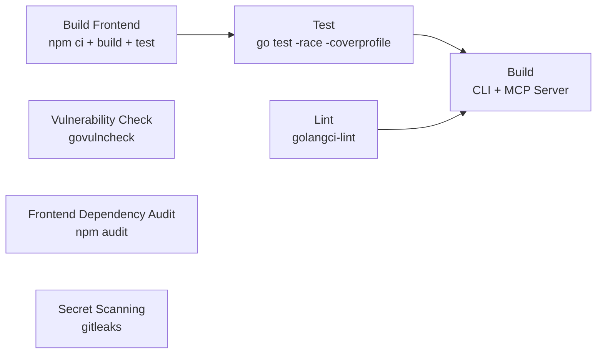

# DeployPilot AI 工作流程规范 - 详细参考

> **使用方式**：本文件是 `ai-guide.md` 的详细补充。先读 `ai-guide.md` 获取核心规则，遇到需要详细信息时再查阅本文件对应章节。

---

## 第 1 章：仓库概览与环境信息

### 1.1 仓库标识

| 项目 | 值 |
|------|-----|
| Owner | Yogdunana |
| Repo | deploypilot |
| API Base | `https://api.github.com/repos/Yogdunana/deploypilot` |
| 许可证 | BSL 1.1 (Change Date 2029-04-28, Change License MIT) |

### 1.2 技术栈矩阵

| 层级 | 技术 | 版本 |
|------|------|------|
| 后端语言 | Go | 1.24 |
| 后端框架 | Gin | - |
| 后端 ORM | GORM | - |
| 前端框架 | Vue | 3.5 |
| 前端语言 | TypeScript | strict 模式 |
| 构建工具 | Vite | 6 |
| CSS 框架 | Tailwind CSS | 4 |
| 状态管理 | Pinia | 2 |
| 路由 | Vue Router | 4 (History 模式) |
| HTTP 客户端 | Axios | - |
| UI 组件库 | Radix Vue | - |
| 包管理器 | npm | - |

### 1.3 架构说明

DeployPilot 采用三二进制架构：

| 二进制 | 说明 |
|--------|------|
| `deploypilot` | CLI 命令行工具 |
| `api-server` | REST API + Web Dashboard |
| `mcp-server` | MCP stdio 协议服务器 |

**前端嵌入机制**：
- 后端使用 Go `net/http.Server` + Gin 框架直接监听端口
- 前端通过 Go `embed` 嵌入到二进制中（`web/embed.go` -> `webfs.DistFS`）
- 静态文件由 `internal/server/server.go` 的 `serveStaticFiles()` 提供
- 默认端口 8080，通过 `server.port` 配置项可调
- 用户可通过 `deploypilot reset port --port <新端口>` 修改端口

**禁止**假设面板前端由 Nginx 代理或固定在 8080 端口。

### 1.4 凭证管理

- Token 从环境变量或用户配置获取，**禁止**硬编码
- PAT Token：通过环境变量 `GH_TOKEN` 或 `GITHUB_TOKEN` 提供，也可配置在 `~/.config/gh/hosts.yml` 中
- 主要通过 MCP GitHub 工具操作，PAT 用于 MCP 无法处理的场景

### 1.5 GitHub 身份

所有 commits/PRs 使用 Yogdunana 身份。

### 1.6 仓库元数据

| 字段 | 值 |
|------|-----|
| description | The AI-native deployment gateway -- bridge sandboxed AI IDEs to your infrastructure via MCP protocol |
| homepage | `https://github.com/Yogdunana/deploypilot/wiki` |
| topics | `ai`, `cli`, `deployment`, `devops`, `dns`, `docker`, `go`, `kubernetes`, `mcp`, `model-context-protocol`, `self-hosted`, `ssl`, `vue` |
| visibility | public |
| default_branch | main |
| license | BSL 1.1（SPDX 列表无此协议，显示为 "Other"，使用静态 badge） |

**禁止**修改 `default_branch`、`visibility` 等核心配置。

### 1.7 CODEOWNERS

所有模块的 code owner 为 `@Yogdunana`：

```
* @Yogdunana
/internal/ @Yogdunana
/cmd/ @Yogdunana
/web/ @Yogdunana
.github/workflows/ @Yogdunana
/docs/ @Yogdunana
README.md @Yogdunana
```

PR 合并需要 code owner 审批（当前 review requirement 已设为 0，Agent 可自主合并）。

---

## 第 2 章：Git 工作流规范

### 2.1 分支策略与保护规则

#### 分支保护

main 分支受保护，直接 push 会被拒绝（409 Conflict）。操作流程：
1. 创建 feature 分支
2. 提交并 push 到远端
3. 创建 PR（通过 GitHub MCP 或 API）
4. 合并前临时解除保护
5. 合并 PR
6. 恢复分支保护
7. 合并后删除远端分支

#### 分支命名约定

| 前缀 | 用途 |
|------|------|
| `feat/<short-desc>` | 新功能 |
| `fix/<short-desc>` | Bug 修复 |
| `chore/<short-desc>` | 构建/工具/依赖 |
| `docs/<short-desc>` | 文档变更 |
| `refactor/<short-desc>` | 代码重构 |
| `test/<short-desc>` | 测试相关 |

#### 保护规则 JSON

```json
{
  "required_status_checks": {
    "strict": true,
    "contexts": [
      "Build Frontend",
      "Test (race + coverage)",
      "Lint (golangci-lint)",
      "Build",
      "Vulnerability Check",
      "Frontend Dependency Audit",
      "Secret Scanning"
    ]
  },
  "enforce_admins": true,
  "required_pull_request_reviews": {
    "dismiss_stale_reviews": true,
    "require_code_owner_reviews": false,
    "required_approving_review_count": 0
  },
  "restrictions": null,
  "allow_force_pushes": false,
  "allow_deletions": false,
  "block_creations": false
}
```

#### 临时解除保护

```bash
curl -s -X DELETE -H "Authorization: token $TOKEN" \
  "https://api.github.com/repos/Yogdunana/deploypilot/branches/main/protection"
```

#### 恢复保护

```bash
curl -s -X PUT -H "Authorization: token $TOKEN" \
  "https://api.github.com/repos/Yogdunana/deploypilot/branches/main/protection" \
  -d '{"required_status_checks":{"strict":true,"contexts":["Build Frontend","Test (race + coverage)","Lint (golangci-lint)","Build","Vulnerability Check","Frontend Dependency Audit","Secret Scanning"]},"enforce_admins":true,"required_pull_request_reviews":{"dismiss_stale_reviews":true,"require_code_owner_reviews":false,"required_approving_review_count":0},"restrictions":null,"allow_force_pushes":false,"allow_deletions":false,"block_creations":false}'
```

#### Merge 策略

Squash merge only。**禁止** merge commit，**禁止**使用 `--merge` 参数。

```bash
gh pr merge <number> --squash --admin
```

使用 `--merge` 会报错：`Merge commits are not allowed on this repository.`

### 2.2 Conventional Commits 规范

#### 格式

```
<type>(<scope>): <description>
```

#### Type 列表及适用场景

| Type | 说明 | 适用场景 |
|------|------|----------|
| `feat` | 新功能 | 新增业务功能、API 接口、MCP 工具 |
| `fix` | Bug 修复 | 修复已知缺陷、回归问题 |
| `docs` | 文档变更 | README、Wiki、注释更新 |
| `refactor` | 代码重构 | 非功能性代码结构调整 |
| `test` | 测试相关 | 新增/修改测试用例 |
| `chore` | 构建/工具/依赖 | Makefile、CI 配置、依赖升级 |
| `ci` | CI 配置变更 | GitHub Actions workflow 修改 |
| `perf` | 性能优化 | 算法优化、缓存策略改进 |
| `style` | 代码格式 | 无逻辑变更的格式调整 |
| `revert` | 回滚提交 | 撤销之前的提交 |

#### PR 关联 Issue

PR 描述中**必须**使用 `Fixes #xx` 或 `Closes #xx` 来自动关闭关联 Issue。没有关联的 Issue 不会自动关闭，导致里程碑进度不准确。

### 2.3 PR 创建与合并流程

1. 创建 feature 分支：`git checkout -b feat/xxx`
2. 提交并 push 到远端
3. 创建 PR（通过 GitHub MCP 或 API）
4. 等待 7 项 CI 检查全部通过
5. 合并前临时解除分支保护
6. Squash merge：`gh pr merge <number> --squash --admin`
7. 恢复分支保护
8. **等待 main CI 全部通过**（踩坑 #14，不能仅凭 PR branch CI）
9. 删除远端分支

**注意事项**：
- PR 标题遵循 Conventional Commits 格式
- PR 审批：review requirement 已设为 0，Agent 可自主合并
- 合并后 main 分支会触发新的 CI run，**必须**等待该 run 全部通过后再确认任务完成。main CI 可能因 squash merge 的 commit hash 不同而暴露新问题

### 2.4 Issue 创建规范

#### 标题格式

Issue 标题遵循 Conventional Commits 格式：

```
<type>: <简短描述>
```

示例：`feat: 支持 SSL 证书自动续期`、`fix: Docker 构建缺少 go.sum 条目`、`security: ListImages filter 命令注入漏洞`

#### 描述模板

```markdown
## 问题描述

[清晰描述问题或需求]

## 复现步骤（Bug 类 Issue）

1. [步骤 1]
2. [步骤 2]
3. [观察到的错误行为]

## 期望行为

[描述期望的正确行为]

## 实际行为

[描述当前的实际行为]

## 环境（可选）

- 版本：
- 操作系统：
- 部署方式：
```

#### Label 规范

| Label | 用途 |
|-------|------|
| `bug` | Bug 修复 |
| `enhancement` | 新功能/改进 |
| `security` | 安全相关 |
| `documentation` | 文档相关 |
| `good first issue` | 适合新手 |

#### Milestone 关联

- **必须**为每个 Issue 分配 Milestone（对应当前开发版本）
- 版本完成时检查所有 Milestone 中的 open issue（踩坑 #20）
- 延后的 Issue 移至下一个 Milestone，**禁止**直接关闭

#### 与 PR 的双向关联

- PR 描述中使用 `Fixes #xx` 或 `Closes #xx` 自动关闭关联 Issue（踩坑 #3）
- Issue 中可通过 `Related PR: #xx` 引用关联的 PR
- 没有关联 Issue 的 PR 不会自动关闭 Issue，导致里程碑进度不准确

### 2.5 仓库模板文件规范

#### Issue 模板

仓库配置了 4 个 Issue 模板文件（位于 `.github/ISSUE_TEMPLATE/`）：

| 模板文件 | 用途 | 触发方式 |
|----------|------|----------|
| `bug_report.yml` | Bug 报告 | 创建 Issue 时选择 "Bug report" 表单 |
| `feature_request.yml` | 功能请求 | 创建 Issue 时选择 "Feature request" 表单 |
| `phase.yml` | 版本阶段规划 | 创建 Issue 时选择 "Phase" 表单 |
| `config.yml` | 模板配置 | 控制模板列表和联系链接 |

**创建 Issue 时应使用对应的模板**，填写所有必填字段。

#### PR 模板

`.github/PULL_REQUEST_TEMPLATE.md` 包含以下必填段落：
- **Description**：变更描述
- **Type of Change**：变更类型（Bug fix / New feature / Breaking change / Documentation update / Refactoring / Security fix）
- **Related Issue**：关联 Issue 编号
- **Changes Made**：具体变更内容
- **Testing**：测试情况
- **Breaking Changes**：是否有破坏性变更
- **Checklist**：检查清单

**创建 PR 时必须填写所有段落**，不得留空。

#### .gitignore

`.gitignore` 覆盖以下类别：
- 二进制文件：`bin/`、`*.exe`、`*.dll`、`*.so`、`*.dylib`、构建产物（`/api-server`、`/deploypilot`、`/mcp-server`）
- 测试文件：`*.test`、`*.out`、`coverage.out`、`*.prof`
- IDE 文件：`.idea/`、`.vscode/`、`*.swp`、`*.swo`、`*~`
- 系统文件：`.DS_Store`、`Thumbs.db`
- 环境变量：`.env`、`.env.local`
- 前端：`web/node_modules/`、`web/dist/`
- 构建缓存：`/tmp/`

**禁止**将 `.env` 文件提交到仓库。

### 2.6 GitHub 安全功能配置

#### Dependabot

`.github/dependabot.yml` 配置了 3 个生态系统的自动依赖更新：

| 生态系统 | 目录 | 调度频率 | PR 上限 | 标签 | 审阅者 | 分组策略 |
|----------|------|----------|---------|------|--------|----------|
| `gomod` | `/` | weekly | 10 | `dependencies` | `Yogdunana` | `go-minor-patch`（仅 minor + patch） |
| `npm` | `/web` | weekly | 10 | `dependencies` | `Yogdunana` | `npm-minor-patch`（仅 minor + patch） |
| `github-actions` | `/` | monthly | 5 | `dependencies` + `github-actions` | `Yogdunana` | 无 |

Dependabot PR **必须**经过 `make check` 验证后再合并。

#### Secret Scanning

- CI 中配置了 gitleaks 进行密钥泄露扫描
- 当前状态：**已启用为阻断检查**（PR #261 修复）

#### Vulnerability Scanning

- CI 中配置了 govulncheck（Go）和 npm audit（前端）
- govulncheck 已升级为阻断检查（Go 1.24，PR #261 修复）
- stdlib 漏洞以 warning 形式报告（需 Go 补丁版本修复）
- npm audit 不再 `continue-on-error`（PR #127 修复）

### 2.7 Label 规范

仓库共配置 26 个 Label，分为以下类别：

#### 优先级 Label

| Label | 颜色 | 用途 |
|-------|------|------|
| `priority: critical` | `#B60205` | 必须立即修复 |
| `priority: high` | `#D93F0B` | 重要，尽快处理 |
| `priority: medium` | `#FBCA04` | 正常队列 |
| `priority: low` | `#0E8A16` | 锦上添花，backlog |

#### 区域 Label

| Label | 颜色 | 用途 |
|-------|------|------|
| `area: backend` | `#0052CC` | 后端 / Go 代码 |
| `area: frontend` | `#0052CC` | 前端 / Vue 代码 |
| `area: docs` | `#0052CC` | 文档 |
| `area: infra` | `#0052CC` | 基础设施 / CI/CD / Docker |

#### 类型 Label

| Label | 颜色 | 用途 |
|-------|------|------|
| `bug` | `#d73a4a` | Bug 修复 |
| `enhancement` | `#a2eeef` | 新功能 |
| `security` | `#ededed` | 安全相关 |
| `documentation` | `#0075ca` | 文档相关 |
| `refactor` | `#ededed` | 代码重构 |
| `testing` | `#ededed` | 测试相关 |
| `architecture` | `#ededed` | 架构设计 |
| `ui/ux` | `#ededed` | 用户界面 |
| `developer-experience` | `#ededed` | 开发者体验 |
| `business` | `#ededed` | 商业模式 |

#### 状态 Label

| Label | 颜色 | 用途 |
|-------|------|------|
| `in progress` | `#E3B341` | 正在处理 |
| `blocked` | `#B60205` | 等待依赖 |
| `good first issue` | `#7057ff` | 适合新手 |
| `help wanted` | `#008672` | 需要帮助 |
| `wontfix` | `#ffffff` | 不会处理 |
| `invalid` | `#e4e669` | 无效 |
| `duplicate` | `#cfd3d7` | 重复 |
| `question` | `#d876e3` | 疑问 |

**创建 Issue/PR 时必须添加对应的 Label**（至少一个优先级 + 一个区域/类型）。

### 2.8 Milestone 管理规范

#### 当前里程碑规划

| # | 标题 | 描述 | 状态 | Open Issues | Closed Issues |
|---|------|------|------|-------------|---------------|
| 1 | v1.1: Security & Stability | 安全与稳定性 | Closed | 0 | 1 |
| 2 | v1.2: Adapter Layer Refactor | 适配器层重构 | Closed | 0 | 1 |
| 3 | v1.3: Deployment Enhancement | 部署增强 | Closed | 0 | 3 |
| 4 | v1.4: Enterprise Features | 企业特性 | Closed | 0 | 7 |
| 5 | v1.5: Notification & Alerting | 事件总线、SMTP/Bark/SMS、告警规则、模板 | Closed | 0 | 11 |
| 6 | v1.6: Monitoring & Observability | Uptime、心跳、Prometheus、Dashboard TV | Closed | 0 | 7 |
| 7 | v1.7: Ecosystem Integration | OpenClaw、Grafana、Webhooks、API 平台、插件 | Closed | 0 | 6 |
| 8 | v1.8: Commercial & Licensing | License Key、OpenCore、Feature Flags、Pro/Free | Closed | 0 | 7 |
| 9 | v1.9: Security Hardening | 审计验证、IP 白名单、设备绑定、代码签名、密钥轮换 | Closed | 0 | 11 |
| 10 | v1.10: Engineering Quality | 迁移策略、测试体系、开发环境、社区建设、Changelog 自动化 | Closed | 0 | 9 |
| 11 | v1.1 — 安全与稳定性 | 安全与稳定性（旧版 Milestone） | Closed | 0 | 4 |
| 12 | v1.11: Security Hardening & DevEx | CI 安全扫描、SSH root fallback、Changelog 自动化、性能基准 | Closed | 0 | 3 |

#### 管理规则

- **必须**为每个 Issue 分配 Milestone（对应当前开发版本）
- 版本完成时执行 6 步检查清单（踩坑 #20）：
  1. Milestone Issue 清理（确认 0 个 open issue）
  2. Milestone 关闭
  3. CHANGELOG 更新
  4. Tag + Release
  5. 孤立 Issue 巡检
  6. Roadmap 确认
- 延后的 Issue 移至下一个 Milestone，**禁止**直接关闭
- **禁止**删除 Milestone

---

## 第 3 章：CI/CD 流水线规范

### 3.1 PR 检查项详解（7 项）

PR 合并前必须全部通过的 check-runs：

| 检查项 | 说明 | 关键配置 |
|--------|------|----------|
| Build | 构建 CLI + MCP Server | 依赖 Test + Lint |
| Test | Go 测试（race + coverage） | `go test -race -coverprofile` |
| Lint | golangci-lint 检查 | golangci-lint v2.1.0 |
| Frontend Dependency Audit | npm 安全审计 | `npm audit --audit-level=high`，不再 continue-on-error（PR #127 修复） |
| Vulnerability Check | Go 漏洞扫描 | govulncheck，stdlib 漏洞以 warning 报告 |
| Secret Scanning | 密钥泄露扫描 | gitleaks |
| Build Frontend | 前端构建 | Node 20, npm ci + build + test |

`build-and-push` 和 Release workflow 是独立触发的，不在 PR check 中。

### 3.2 检查项依赖关系

**关键路径**：Build Frontend -> Test -> Build
**并行组**：Vulnerability Check / Frontend Dependency Audit / Secret Scanning



### 3.3 本地预检查命令

| 命令 | 说明 |
|------|------|
| `make check` | vet + lint + test 全量检查 |
| `make build-all` | 三二进制构建 |
| `cd web && npm ci && npm run build && npm test` | 前端完整检查 |

**修改 go.mod 后必须执行** `go mod tidy`（踩坑 #1，否则 Docker/Release 构建失败：`missing go.sum entry`）。

### 3.4 Release 与 Docker 构建流程

#### 版本号管理

版本号通过 git tag 和 `-ldflags` 管理，**禁止**直接改 `version.go`（踩坑 #2，默认值 "dev"）。
`internal/version/version.go` 中 `var Version = "dev"` **禁止**修改。

#### release.yml 触发条件

`v*` tag push 触发 release workflow 自动构建。

#### Tag 创建与版本号注入

- **必须**使用 annotated tag（**禁止** lightweight tag）

```bash
git tag -a v1.x.0 -m "v1.x.0 -- 版本标题"
git push origin v1.x.0
```

- 版本号通过 `-ldflags` 在构建时注入，**禁止**直接修改 `version.go`

```bash
go build -ldflags "-X github.com/Yogdunana/deploypilot/internal/version.Version=v1.x.0"
```

#### 多架构构建与 Docker 发布

- release.yml 自动触发多架构构建：`linux/amd64` + `linux/arm64`
- Docker 镜像发布到：`ghcr.io/yogdunana/deploypilot`
- 构建产物包含三个二进制：`deploypilot`、`api-server`、`mcp-server`

#### 版本完成检查清单（踩坑 #20，6 步）

1. **Milestone Issue 清理**：确认 milestone 中 0 个 open issue（关闭已实现的，移除延后的）
2. **Milestone 关闭**：通过 API 关闭 milestone
3. **CHANGELOG 更新**：将 [Unreleased] 内容移至版本段，添加日期和链接
4. **Tag + Release**：创建 annotated tag 并推送，触发 release.yml 自动构建
5. **孤立 Issue 巡检**：检查并关联所有无 milestone 的 open issues
6. **Roadmap 确认**：确认所有 Phase 状态正确

**反例**：v1.2 Roadmap 全部标记完成但 milestone 仍 OPEN、无 Release/Tag、存在孤立 issues。

---

## 第 4 章：代码规范

### 4.1 Go 后端规范

#### Import 规范

- Go factored import **禁止**用逗号分隔（踩坑 #11）

```go
// 错误 -- 会导致 syntax error: unexpected comma
import (
    "fmt",
    "encoding/json",
)
// 正确
import (
    "fmt"
    "encoding/json"
)
```

- 提取方法到新文件时**必须**检查 unused imports（踩坑 #8，用 `grep -c "pkg." file.go` 检查每个包的引用次数）
- 新文件**必须**包含完整的 import 声明（踩坑 #9，常见需要：`context`、`fmt`、`strings`、`time`、`encoding/json`、`log/slog`）
- 删除函数后**必须**检查 import 是否仍被使用（踩坑 #27，golangci-lint 的 `unused` 检查会报错）

#### 变量与作用域

- `if` 内 `:=` 声明在外层不可见（踩坑 #26），需要在外层先 `var err error`

```go
// 错误 -- err 在 if 块外不可见
if err := doSomething(); err == nil { return }
if err != nil { ... }  // 编译错误：err 未定义

// 正确
var err error
if err = doSomething(); err == nil { return }
if err != nil { ... }
```

- 提取闭包到独立函数时注意变量名更新（踩坑 #12，闭包中引用的外层变量名需要更新为函数参数名）

#### 接口与 Mock

- 新增 Deployer 接口方法**必须**同步更新 mockDeployer（踩坑 #25）

```go
// stub 模式
func (m *mockDeployer) MethodName(_ context.Context, ...) (type, error) {
    return zeroValue, nil
}
```

- mock key **必须**与实际代码一致（踩坑 #4，如果实际代码用了 `shellQuote()`，mock 也需要包含引号）
- `plugin.Global()` **必须**自动注册内置插件（踩坑 #15，创建空 Registry 后必须调用 `RegisterBuiltinPlugins()`）

#### 错误处理

- 重构 service 层 switch/case 时注意错误语义（踩坑 #16）：
  - provider 未配置（DB 中没有）-> 200 + error body（客户端错误）
  - 不支持的 provider type -> 500（Go error，服务端错误）
  - database not available -> 500（Go error，服务端错误）
  - 使用 sentinel error（`errors.New` + `errors.Is`）区分"客户端错误"和"服务端错误"
- Circuit Breaker 的 `State()` 方法**必须**原子更新状态（踩坑 #18，检测到 Open 超时后用写 Lock 更新为 HalfOpen，否则 `Execute()` 中读到的 state 可能不一致）
- `NewSSLProvider` 返回接口后测试需要类型断言（踩坑 #19，`p.(*SSLProvider)`）
- config 从 struct 改为 `map[string]interface{}` 后测试需要更新期望值（踩坑 #17，map 接受任何 JSON，原来会因类型不匹配而失败的 config 现在不会失败）

#### 安全编码

- 所有 shell 命令中的用户输入**必须** `shellQuote()`（踩坑 #6，涉及 `builder.go` 和 `bridge.go`）
- Docker login **必须**用 `--password-stdin`（踩坑 #7，**禁止** `-u user -p pass`，密码会暴露在进程列表中）

#### 版本管理

- `internal/version/version.go` 中 `var Version = "dev"` **禁止**修改（踩坑 #2）

#### Mock Server

- Go 1.22+ `http.ServeMux` subtree pattern (`/path/`) 可能导致路由歧义
- **推荐**：使用 `http.HandlerFunc` + `switch` 语句替代 `mux.HandleFunc`
- DELETE `/api/v1/resource/{id}` 路径需要单独的 prefix 匹配 handler

#### 大文件处理

- `bridge_test.go` 等大文件（>90KB）超过 MCP 工具内容字段限制
- **解决方案**：通过 raw GitHub API 下载 -> 本地 Python 编辑 -> base64 编码后 `PUT /contents` 推送

```bash
# 1. 下载原始文件
curl -sL "https://raw.githubusercontent.com/Yogdunana/deploypilot/main/internal/service/bridge_test.go" -o bridge_test.go

# 2. 本地编辑（Python 脚本）

# 3. base64 编码并推送
CONTENT=$(base64 -w0 bridge_test.go)
SHA=$(gh api /repos/Yogdunana/deploypilot/contents/internal/service/bridge_test.go --jq '.sha')
gh api /repos/Yogdunana/deploypilot/contents/internal/service/bridge_test.go \
  --method PUT \
  -f message="fix: update bridge_test.go" \
  -f content="$CONTENT" \
  -f sha="$SHA"
```

#### MCP 开发规范

- `withPermissionCheck` 中间件在每次工具调用后自动记录到 `ContextManager`
- 跳过记录上下文管理工具：`list_recent_operations`、`clear_context`、`get_context`
- 结果文本截断到 500 字符避免内存膨胀

#### mcp-go v0.47.0 类型注意

- `CallToolParams` 是值类型（非指针），不能与 `nil` 比较
- `CallToolParams.Arguments` 是 `any` 类型，需类型断言为 `map[string]any`
- `CallToolResult.Content` 是 `[]Content`，`TextContent` 实现了 `Content` interface

#### 文档与 Markdown 规范

**GitHub Mermaid 兼容性**：
- GitHub 的 Markdown 处理器会将 `-->` 编码为 `--&gt;`，导致 `graph LR` 语法中的边标签解析失败
- **解决方案**：使用 `flowchart LR` 语法，移除所有边标签
- **禁止**在 GitHub 文档中使用 `graph LR`，**必须**使用 `flowchart LR`

**BSL 1.1 License Badge**：
- BSL 1.1 不在 GitHub 标准 SPDX 列表中，动态 badge (`img.shields.io/github/license/...`) 显示 "Other"
- **解决方案**：使用静态 badge `img.shields.io/badge/License-BSL_1.1-blue`

**GitHub API 内容编码**：
- 通过 API 获取文件内容时，HTML 特殊字符以实体形式存在（`&lt;br&gt;` 而非 `<br>`）
- 字符串匹配/替换时**必须**使用 `&lt;` `&gt;` `&amp;` 而非原始字符

### 4.2 Vue 前端规范

- Composition API + `<script setup lang="ts">`
- 使用共享 UI 组件（`web/src/components/ui/`）
- i18n 支持（en.ts + zh.ts 双语）
- Pinia 2 测试使用原生 `createPinia()` + `setActivePinia()`（踩坑 #13，**禁止**使用 `@pinia/testing@1.x`，它与 Pinia 2.x 不兼容）
- Tailwind CSS 4 + Radix Vue 组件库

### 4.3 数据库变更规范

- 新增列**必须**用迁移（踩坑 #5，**禁止**直接改 CREATE TABLE 语句，使用 `ALTER TABLE ... ADD COLUMN` + `ignoreDuplicateColumnError`）
- 新增 App 模型字段**必须**同步更新所有测试的 CREATE TABLE（踩坑 #24，涉及文件清单）：
  - `internal/api/api_test.go`
  - `internal/api/sse_test.go`
  - `internal/api/ws_test.go`
  - `internal/service/rollback_test.go`
- **最佳实践**：使用 GORM AutoMigrate 而非硬编码 DDL

### 4.4 文档同步规则

修改以下内容时，**必须**同步更新所有相关文档：

| 变更类型 | 需同步的文件 |
|----------|-------------|
| 配置字段变更 | `configs/config.yaml.example` + `docs/wiki/Configuration.md` + `README.md` + `README_zh-CN.md` |
| 新增 API 路由 | `internal/api/router.go` + Swagger 注释 + `docs/swagger/` |
| 新增 MCP 工具 | `internal/mcp/server.go` + `docs/mcp-tools.md` + `docs/wiki/MCP-Integration.md` |
| 数据库 Schema 变更 | `internal/database/database.go` + 测试文件中的 CREATE TABLE |
| Roadmap Phase 完成 | `docs/wiki/Roadmap.md` + 关联 Issue + Milestone 状态 |
| 版本完成 | Milestone 关闭 + CHANGELOG 更新 + Tag/Release 创建 + 孤立 Issue 关联 |

---

## 第 5 章：安全检查规范

### 5.1 Secret Scanning

- CI 配置：gitleaks，fetch-depth: 0
- 当前状态：**已启用为阻断检查**（PR #261 修复）
- Token 管理原则：环境变量获取，**禁止**硬编码

### 5.2 Vulnerability Check

- CI 配置：govulncheck（Go 1.24）
- 当前状态：**已启用为阻断检查**（PR #261 修复），stdlib 漏洞以 warning 报告

### 5.3 依赖审计

- 前端：`npm audit --audit-level=high`（PR #127 后不再 continue-on-error）
- 后端：govulncheck + gosec（通过 golangci-lint）

### 5.4 编码安全实践

- shell 命令参数转义（踩坑 #6，所有 shell 命令中的用户输入**必须** `shellQuote()`）
- Docker login 使用 `--password-stdin`（踩坑 #7，**禁止** `-u user -p pass`）
- 数据库安装前**必须**预检测已有实例（踩坑 #21，检测方式：`systemctl status` / `docker ps` / `ss -tlnp`）
- Web 服务器缺失时**必须**提示用户选择（踩坑 #22，**禁止**自行决定安装 Apache/Nginx/OpenResty）
- DeployPilot 面板使用 Go 内嵌 HTTP 服务器（踩坑 #23，**禁止**假设面板依赖 Nginx）
- Redis Pub/Sub **必须**防止消息回环（踩坑 #28，使用 SourceInstance 标识）

#### 已知安全漏洞（已全部修复）

| 编号 | 严重级别 | 描述 | 位置 | 修复 |
|------|----------|------|------|------|
| Issue #113 | Critical | ListImages filter 命令注入 | `bridge.go` | ✅ PR #119，`shellQuote(filter)` |
| Issue #114 | - | CI 安全扫描形同虚设 | `.github/workflows/ci.yml` | ✅ PR #261，Go 1.24 + govulncheck 阻断 |
| Issue #115 | - | SSH 静默回退 root | `bridge.go`, `ssh_service.go` | ✅ PR #261，返回 error |
| - | - | DNS 服务吞掉错误 | `dns_service.go` | ✅ PR #261，BatchDNS 返回 error |
| - | - | Backup/PortForward shellQuote | `backup_service.go`, `bridge.go` | ✅ PR #119，`shellQuote()` 转义 |

### 5.5 内容安全

- DNS 测试失败日志中的 provider 错误信息可能触发内容过滤
- **禁止**粘贴原始 DNS 测试错误日志，用自然语言描述即可
- 涉及第三方服务错误信息时，脱敏后再记录到文档或 Issue 中

---

## 第 6 章：测试要求

### 6.1 Go 测试规范

- 命令：`go test -race -coverprofile=coverage.out -count=1 ./...`
- **必须**启用 race detector
- 覆盖率阈值：80%（CI 中低于阈值产生 warning）
- `t.Helper()` 用于测试辅助函数
- mock 模式**必须**与实际代码一致（踩坑 #4）
- 新增接口方法**必须**同步 mock（踩坑 #25）
- 测试中硬编码 DDL **必须**与模型同步（踩坑 #24）

### 6.2 前端测试规范

- 框架：Vitest 4 + @vue/test-utils + jsdom
- 命令：`npm test`（在 `web/` 目录下）
- Pinia store 测试使用原生 `createPinia()` + `setActivePinia()`（踩坑 #13，**禁止**使用 `@pinia/testing@1.x`）

### 6.3 覆盖率要求

| 项目 | 目标覆盖率 | CI 阈值 | 本地查看 |
|------|-----------|---------|---------|
| Go | >85% | 80% | `make coverage` / `make coverage-html` |
| 前端 | CI 中 `npm test` **必须**通过 | - | `cd web && npm test` |

---

## 第 7 章：开发流程规范

### 7.1 本地开发环境搭建

#### 环境要求

| 工具 | 版本要求 | 用途 |
|------|----------|------|
| Go | 1.23+ | 后端编译 |
| Node.js | 20+ | 前端构建 |
| npm | 10+ | 前端包管理 |
| Docker | 20.10+ | 容器化构建/测试 |
| Make | 3.80+ | 构建命令 |
| golangci-lint | v2.1.0 | Lint 检查 |
| Git | 2.30+ | 版本控制 |

#### 后端启动

```bash
# 1. 克隆仓库
git clone https://github.com/Yogdunana/deploypilot.git
cd deploypilot

# 2. 安装依赖
go mod download

# 3. 复制配置文件
cp configs/config.yaml.example configs/config.yaml
# 编辑 configs/config.yaml 填写实际配置

# 4. 构建
make build-all

# 5. 运行 API Server
./api-server

# 6. 运行 CLI
./deploypilot --help

# 7. 运行 MCP Server
./mcp-server
```

#### 前端开发

```bash
# 1. 进入前端目录
cd web

# 2. 安装依赖
npm ci

# 3. 启动开发服务器
npm run dev

# 4. 运行测试
npm test
```

#### 数据库初始化

- 数据库 Schema 通过 GORM AutoMigrate 自动创建，无需手动执行 SQL
- **禁止**手动修改已有数据库的 CREATE TABLE 语句（踩坑 #5）
- 新增列必须通过迁移文件（`ALTER TABLE ... ADD COLUMN`）

### 7.2 新增 MCP 工具标准流程

#### 文件命名约定

| 文件类型 | 命名格式 | 示例 |
|----------|----------|------|
| Handler | `handler_<tool_name>.go` | `handler_deploy_app.go` |
| Register | `register_<tool_name>.go` | `register_deploy_app.go` |

#### 开发步骤

1. 在 `internal/mcp/types.go` 中定义请求/响应 struct（如需要）
2. 创建 `internal/mcp/handler_<tool_name>.go`，实现工具处理逻辑
3. 创建 `internal/mcp/register_<tool_name>.go`，注册工具到 Server
4. 在 `internal/mcp/server_test.go` 的 `mockDeployer` 中添加对应的 stub 方法（踩坑 #25）
5. 编写单元测试
6. 更新 `docs/mcp-tools.md` 和 `docs/wiki/MCP-Integration.md`（文档同步规则）

#### 权限声明

- 通过 `withPermissionCheck` 中间件声明工具权限
- 工具调用结果自动记录到 `ContextManager`（结果截断到 500 字符）
- 上下文管理工具（`list_recent_operations`、`clear_context`、`get_context`）跳过记录

#### 参数校验

- `CallToolParams.Arguments` 是 `any` 类型，需类型断言为 `map[string]any`（mcp-go v0.47.0）
- `CallToolParams` 是值类型（非指针），不能与 `nil` 比较
- 所有用户输入传到 shell 命令时**必须** `shellQuote()`（踩坑 #6）

### 7.3 新增 API 端点标准流程

#### 开发步骤

1. 在 `internal/api/` 下创建或修改 handler 文件
2. 在 `internal/api/router.go` 中注册路由
3. 添加 Swagger 注释（`@Summary`、`@Description`、`@Tags`、`@Param`、`@Success`、`@Failure`）
4. 编写单元测试（注意同步更新测试中的 CREATE TABLE，踩坑 #24）
5. 运行 `make check` 确认通过
6. 更新 `docs/swagger/` 文档

#### 注意事项

- 新增 App 模型字段时**必须**同步更新 4 个测试文件的 CREATE TABLE（踩坑 #24）：
  - `internal/api/api_test.go`
  - `internal/api/sse_test.go`
  - `internal/api/ws_test.go`
  - `internal/service/rollback_test.go`
- API 错误响应需区分客户端错误（200 + error body）和服务端错误（500），使用 sentinel error（踩坑 #16）

### 7.4 依赖升级流程

#### Go 依赖升级

```bash
# 1. 升级指定依赖
go get github.com/example/pkg@latest

# 2. 更新 go.sum（踩坑 #1，**必须**执行）
go mod tidy

# 3. 运行全量检查
make check

# 4. 检查是否有破坏性变更
go test -race -count=1 ./...
```

**注意事项**：
- 修改 `go.mod` 后**必须**运行 `go mod tidy`，否则 Docker/Release 构建失败（踩坑 #1）
- `internal/version/version.go` 的 `var Version = "dev"` **禁止**修改（踩坑 #2）
- 升级后检查是否有新增的 import 需要添加或旧的 import 需要移除（踩坑 #8/#9/#27）

#### npm 依赖升级

```bash
cd web

# 1. 检查过期依赖
npm outdated

# 2. 升级指定依赖
npm install <package>@latest

# 3. 运行前端完整检查
npm ci && npm run build && npm test

# 4. 安全审计
npm audit --audit-level=high
```

**注意事项**：
- **禁止**使用 `@pinia/testing@1.x`，它与 Pinia 2.x 不兼容（踩坑 #13）
- npm audit 不再 `continue-on-error`（PR #127 修复），critical 级别会阻断 CI

### 7.5 Code Review 检查清单

审查 PR 时，按以下清单逐项检查：

#### 必查项

- [ ] **Conventional Commits 格式**：commit message 符合 `<type>(<scope>): <description>` 格式
- [ ] **PR 关联 Issue**：描述中包含 `Fixes #xx` 或 `Closes #xx`（踩坑 #3）
- [ ] **分支命名**：`feat/`、`fix/`、`chore/` 等前缀正确
- [ ] **踩坑记录检查**：是否触发了已知的踩坑场景（对照附录 B）
- [ ] **CI 全部通过**：7 项检查全部绿色
- [ ] **无硬编码 Token**：敏感信息通过环境变量获取

#### Go 代码检查

- [ ] **import 完整性**：新文件包含所有需要的 import（踩坑 #9），无 unused import（踩坑 #8/#27）
- [ ] **import 格式**：factored import 无逗号分隔（踩坑 #11）
- [ ] **变量作用域**：`if` 内 `:=` 声明的外层可见性正确（踩坑 #26）
- [ ] **shellQuote**：所有 shell 命令参数已转义（踩坑 #6）
- [ ] **Docker login**：使用 `--password-stdin`（踩坑 #7）
- [ ] **Mock 同步**：接口新增方法已同步 mock（踩坑 #25），mock key 与实际代码一致（踩坑 #4）
- [ ] **数据库变更**：新增列使用迁移而非直接改 DDL（踩坑 #5），测试 CREATE TABLE 已同步（踩坑 #24）
- [ ] **version.go**：未被修改（踩坑 #2）
- [ ] **plugin.Global()**：已注册内置插件（踩坑 #15）
- [ ] **错误语义**：重构后客户端错误/服务端错误区分正确（踩坑 #16）

#### 前端代码检查

- [ ] **Pinia 测试**：使用原生 `createPinia()`，未使用 `@pinia/testing`（踩坑 #13）
- [ ] **i18n**：新增用户可见文本已添加到 `en.ts` 和 `zh.ts`

#### 文档同步检查

- [ ] **配置变更**：`config.yaml.example` + 文档已同步
- [ ] **API 变更**：Swagger 注释 + 文档已同步
- [ ] **MCP 变更**：`mcp-tools.md` + 文档已同步
- [ ] **踩坑记录**：新发现的坑已记录到本文件附录 B

---

## 附录 A：项目结构关键路径速查表

### 入口层

| 路径 | 说明 |
|------|------|
| `cmd/` | CLI 入口（deploypilot、api-server、mcp-server） |

### API 层

| 路径 | 说明 |
|------|------|
| `internal/api/router.go` | 所有 API 路由注册 |
| `internal/api/api_test.go` | API 测试 |
| `internal/api/sse_test.go` | SSE 测试 |
| `internal/api/ws_test.go` | WebSocket 测试 |
| `internal/api/monitor_api.go` | Monitor API handlers（CRUD + checks + SLA） |
| `internal/api/toolbox_api.go` | Toolbox API handlers（脚本管理 + 系统检测） |
| `internal/api/ws_monitor.go` | WebSocket 监控推送 Hub |

### MCP 层

| 路径 | 说明 |
|------|------|
| `internal/mcp/server.go` | MCP 入口（NewServer + context/permission helpers，71 行） |
| `internal/mcp/types.go` | Deployer 接口 + 12 个 struct 定义 |
| `internal/mcp/handler_*.go` | MCP 工具 handler 文件（含监控、心跳、Toolbox 等） |
| `internal/mcp/register_*.go` | MCP 工具注册文件（含监控、心跳、Toolbox 等） |
| `internal/mcp/server_test.go` | MCP 测试（含 mockDeployer） |

### Service 层

| 路径 | 说明 |
|------|------|
| `internal/service/bridge.go` | Bridge 结构体定义 + 基础设施方法（448 行） |
| `internal/service/*_service.go` | 领域服务文件（Deployer 接口实现） |
| `internal/service/uptime_service.go` | Uptime 监控服务（MonitorService + 模型 + 检查逻辑） |
| `internal/service/uptime_bridge.go` | UptimeService Bridge 适配层 |
| `internal/service/monitor_scheduler.go` | 后台监控调度器 |
| `internal/service/toolbox_service.go` | Toolbox 服务（30 内置脚本 + 系统检测） |
| `internal/service/rollback_test.go` | 回滚测试 |

### 数据层

| 路径 | 说明 |
|------|------|
| `internal/database/database.go` | 数据库迁移定义（含 monitors、monitor_check_results、heartbeats、toolbox_scripts 表） |
| `internal/model/model.go` | 数据模型定义 |

### 配置层

| 路径 | 说明 |
|------|------|
| `internal/config/config.go` | 配置结构体定义 |
| `configs/config.yaml.example` | 配置文件示例（权威来源） |

### 前端层

| 路径 | 说明 |
|------|------|
| `web/` | 前端项目根目录（Vue 3 + TypeScript + Vite 6） |
| `web/embed.go` | 前端嵌入入口 -> `webfs.DistFS` |
| `web/vitest.config.ts` | Vitest 测试配置 |
| `web/src/components/ui/` | 共享 UI 组件 |
| `web/src/lib/utils.ts` | 前端工具函数（cn, formatDate, formatRelativeTime） |
| `web/src/views/UptimeMonitors.vue` | 可用性监控管理页面 |
| `web/src/views/Heartbeats.vue` | 心跳检测管理页面 |
| `web/src/views/StatusPage.vue` | 公共状态页面 |
| `web/src/views/DashboardTV.vue` | 监控大屏页面 |

### 基础设施

| 路径 | 说明 |
|------|------|
| `.github/workflows/ci.yml` | CI 工作流（7 项检查） |
| `.github/workflows/docker.yml` | Docker 构建推送 |
| `.github/workflows/release.yml` | Release 发布 |
| `.github/workflows/benchmark.yml` | 性能基准测试（benchstat 回归检测） |
| `.github/workflows/changelog.yml` | Changelog 自动化 |
| `.github/workflows/e2e.yml` | 端到端测试 |
| `.github/workflows/wiki-sync.yml` | Wiki 同步 |
| `Makefile` | 构建命令集合 |
| `Dockerfile` | Docker 构建文件 |

### 版本

| 路径 | 说明 |
|------|------|
| `internal/version/version.go` | 版本号（默认 "dev"，**禁止**修改） |

---

## 附录 B：踩坑记录速查（按类别索引）

### 维护规范

**何时补充新的踩坑记录**：
1. 遇到新的坑导致 CI 失败、运行时错误或逻辑 bug 时
2. 代码审查中发现重复出现的错误模式时
3. 修复了一个花费较多时间排查的问题时

**如何补充**：
- 编号递增：在附录 B 现有记录的最大编号基础上 +1
- 写入位置：本文件附录 B 对应类别表格末尾
- 同步更新：本附录 B 中按类别添加对应条目

**格式模板**：

```
### N. [简短标题]

[错误现象描述]

**修复**：[正确做法]

- **反例**：[错误做法，如有]
```

**必填字段**：编号、标题、涉及文件路径、错误现象、正确做法。可选字段：反例、相关 Issue 编号。

### 依赖管理

| 编号 | 标题 | 涉及文件 | 正确做法 |
|------|------|----------|----------|
| #1 | go.mod 改版本后必须 go mod tidy | `go.mod`, `go.sum`, `Dockerfile`, `release.yml` | 修改 go.mod 后立即运行 `go mod tidy` 更新 go.sum，否则 Docker/Release 构建失败 |

### 版本管理

| 编号 | 标题 | 涉及文件 | 正确做法 |
|------|------|----------|----------|
| #2 | version.go 默认值是 "dev"，不要改 | `internal/version/version.go` | 版本号通过 git tag 和 `-ldflags` 管理，**禁止**直接修改 version.go |

### Git/PR

| 编号 | 标题 | 涉及文件 | 正确做法 |
|------|------|----------|----------|
| #3 | PR 必须关联 Issue | PR 描述 | 使用 `Fixes #xx` 或 `Closes #xx` 自动关闭关联 Issue |
| #10 | 仓库配置了 squash-only merge | PR 合并 | 使用 `gh pr merge <number> --squash --admin`，**禁止** `--merge` |
| #14 | 合并 PR 后必须确认 main CI 通过 | main 分支 CI | 不能仅凭 PR branch CI 通过就标记完成，必须等待 main 分支新 CI run 全部通过 |

### 测试/Mock

| 编号 | 标题 | 涉及文件 | 正确做法 |
|------|------|----------|----------|
| #4 | 测试中的 mock key 必须与实际代码一致 | `builder_test.go`, `bridge_test.go`, `builder.go`, `bridge.go` | 如果实际代码用了 `shellQuote()`，mock 也需要包含引号 |
| #13 | @pinia/testing 需要 Pinia v3 | 前端测试文件 | 使用原生 `createPinia()` + `setActivePinia()`，**禁止** `@pinia/testing@1.x` |
| #24 | 新增 App 模型字段必须同步更新所有测试的 CREATE TABLE | `internal/model/model.go`, `internal/api/api_test.go`, `internal/api/sse_test.go`, `internal/api/ws_test.go`, `internal/service/rollback_test.go` | 新增字段后同步更新 4 个测试文件中的 CREATE TABLE 语句，最佳实践使用 GORM AutoMigrate |
| #25 | 新增 Deployer 接口方法必须同步更新 mockDeployer | `internal/mcp/types.go`, `internal/mcp/server_test.go` | 添加 stub 方法：`func (m *mockDeployer) MethodName(_ context.Context, ...) (type, error) { return zeroValue, nil }` |

### 数据库

| 编号 | 标题 | 涉及文件 | 正确做法 |
|------|------|----------|----------|
| #5 | 新增数据库列必须用迁移 | `internal/database/database.go` | 使用 `ALTER TABLE ... ADD COLUMN` + `ignoreDuplicateColumnError`，**禁止**直接改 CREATE TABLE 语句 |

### 代码重构

| 编号 | 标题 | 涉及文件 | 正确做法 |
|------|------|----------|----------|
| #8 | 提取方法到新文件时必须检查 unused imports | `internal/service/bridge.go` 及提取后的新文件 | 用 `grep -c "pkg." file.go` 检查每个包的引用次数，逐一确认 import 是否仍被使用 |
| #9 | 新文件必须包含完整的 import 声明 | 新创建的 `*_service.go` 文件 | 搜索文件中所有 `pkg.` 引用，确保对应的 import 都存在（常见：context, fmt, strings, time, encoding/json, log/slog） |
| #11 | Go factored import 不用逗号分隔 | Go 源文件 | 每个导入路径独占一行，**禁止**用逗号分隔 |
| #12 | 提取闭包到独立函数时注意变量名 | `internal/mcp/server.go` | 闭包中引用的外层变量名需要更新为函数参数名 |
| #15 | plugin.Global() 必须自动注册内置插件 | `registry.go` | `Global()` 创建空 Registry 后必须调用 `RegisterBuiltinPlugins()` |
| #16 | 重构 service 层 switch/case 时注意错误语义 | service 层文件 | 用 sentinel error（`errors.New` + `errors.Is`）区分"客户端错误"（200 + error body）和"服务端错误"（500） |
| #17 | config 从 struct 改为 map 后测试需更新期望值 | config 相关测试文件 | map 接受任何 JSON，原来会因类型不匹配而失败的 config 现在不会失败，需更新测试期望值 |
| #18 | Circuit Breaker 的 State() 必须原子更新状态 | Circuit Breaker 实现 | 检测到 Open 超时后用写 Lock 更新为 HalfOpen，不能只返回 HalfOpen 但不修改状态 |
| #19 | NewSSLProvider 返回接口后测试需类型断言 | SSL Provider 测试文件 | 通过类型断言 `p.(*SSLProvider)` 访问内部字段 |
| #26 | Go 变量作用域陷阱：if 内 := 声明在外层不可见 | Go 源文件 | 在外层先 `var err error`，if 中用 `err = doSomething()`（赋值而非声明） |
| #27 | 删除函数后必须检查 import 是否仍被使用 | Go 源文件 | 删除使用特定包的函数后，确认该包的 import 是否变成未使用 |

### 安全

| 编号 | 标题 | 涉及文件 | 正确做法 |
|------|------|----------|----------|
| #6 | 所有 shell 命令中的用户输入必须 shellQuote | `internal/engine/builder/builder.go`, `internal/service/bridge.go` | 所有 shell 命令参数必须通过 `shellQuote()` 转义 |
| #7 | Docker login 必须用 --password-stdin | Docker 相关文件 | 使用 `--password-stdin` + `cmd.Stdin = strings.NewReader(password)`，**禁止** `-u user -p pass` |

### 运维流程

| 编号 | 标题 | 涉及文件 | 正确做法 |
|------|------|----------|----------|
| #20 | 版本完成必须执行完整检查清单 | Milestone, CHANGELOG, Roadmap | 执行 6 步检查清单：Milestone 清理 -> 关闭 -> CHANGELOG 更新 -> Tag + Release -> 孤立 Issue 巡检 -> Roadmap 确认 |
| #21 | 数据库安装前必须预检测已有实例 | 数据库安装流程 | 先用 `systemctl status` / `docker ps` / `ss -tlnp` 检测，已存在则让用户选择复用或全新安装 |
| #22 | Web 服务器组件缺失时必须提示用户选择 | Web 服务器安装流程 | **禁止**自行决定安装哪个，必须暂停工作流提示用户选择 Apache/Nginx/OpenResty |

### 架构

| 编号 | 标题 | 涉及文件 | 正确做法 |
|------|------|----------|----------|
| #23 | DeployPilot 面板使用 Go 内嵌 HTTP 服务器，端口可配置 | `web/embed.go`, `internal/server/server.go` | 面板不依赖 Nginx/Apache/OpenResty，**禁止**假设面板由 Nginx 代理或固定在 8080 端口 |
| #28 | Redis Pub/Sub 多实例广播必须防止消息回环 | WSHub, WSMessage | 使用 SourceInstance（UUID 前 8 位）标识消息来源，接收时跳过自己发出的消息 |

### 已知安全漏洞（已全部修复）

| 编号 | 标题 | 涉及文件 | 正确做法 | 状态 |
|------|------|----------|----------|------|
| #29 | ListImages filter 命令注入 | `bridge.go` | `filter` 参数必须经过 `shellQuote()` 转义后再拼接到 shell 命令 | ✅ PR #119 |
| #30 | CI 安全扫描形同虚设 | `.github/workflows/ci.yml` | 移除 gitleaks/govulncheck/npm audit 的 continue-on-error | ✅ PR #261 |
| #31 | SSH 静默回退 root | `bridge.go`, `ssh_service.go` | username 为空时**禁止**静默回退 root，应返回错误 | ✅ PR #261 |
| #32 | DNS 服务吞掉错误 | `dns_service.go` | **禁止**返回 nil error + 错误 map，应将错误信息通过 error 返回 | ✅ PR #261 |
| #33 | Backup/PortForward shellQuote 未一致使用 | `backup_service.go:41`, `bridge.go:850` | `containerName`、`backupFile`、`RemoteHost` 参数必须经过 `shellQuote()` 转义 | ✅ PR #119 |

---

## 附录 C：常用命令速查

### 本地开发

| 场景 | 命令 |
|------|------|
| 本地全量检查 | `make check` |
| 构建所有二进制 | `make build-all` |
| 运行测试 | `make test` |
| 覆盖率报告 | `make coverage` |
| 覆盖率 HTML 报告 | `make coverage-html` |
| Lint 检查 | `make lint` |
| 前端开发 | `cd web && npm run dev` |
| 前端测试 | `cd web && npm test` |
| 前端完整检查 | `cd web && npm ci && npm run build && npm test` |

### Git 操作

| 场景 | 命令 |
|------|------|
| 创建分支 | `git checkout -b feat/xxx` |
| 修改 go.mod 后 | `go mod tidy` |

### PR 操作

| 场景 | 命令 |
|------|------|
| 合并 PR | `gh pr merge <number> --squash --admin` |

### 分支保护

| 场景 | 命令 |
|------|------|
| 临时解除保护 | `curl -s -X DELETE -H "Authorization: token $TOKEN" "https://api.github.com/repos/Yogdunana/deploypilot/branches/main/protection"` |
| 恢复保护 | `curl -s -X PUT -H "Authorization: token $TOKEN" "https://api.github.com/repos/Yogdunana/deploypilot/branches/main/protection" -d '{"required_status_checks":{"strict":true,"contexts":["Build Frontend","Test (race + coverage)","Lint (golangci-lint)","Build","Vulnerability Check","Frontend Dependency Audit","Secret Scanning"]},"enforce_admins":true,"required_pull_request_reviews":{"dismiss_stale_reviews":true,"require_code_owner_reviews":false,"required_approving_review_count":0},"restrictions":null,"allow_force_pushes":false,"allow_deletions":false,"block_creations":false}'` |

### Release

| 场景 | 命令 |
|------|------|
| 创建 annotated tag | `git tag -a v1.x.0 -m "v1.x.0 -- Title"` |
| 推送 tag | `git push origin v1.x.0` |

---

## 附录 D：Skill 调用指南

AI 助手在操作 DeployPilot 仓库时，应根据任务场景选择合适的 Skill。以下是全部可用 Skill 的触发条件和使用说明。

### 工作流 Skill

| Skill | 触发场景 | 说明 |
|-------|----------|------|
| `brainstorming` | 任何创造性工作开始前（新功能、新组件、行为修改） | 探索需求、设计方案，**必须**在实现前调用。输出设计文档后转入 `writing-plans` |
| `writing-plans` | 有明确需求/规格后，编写实现计划 | TDD、bite-sized tasks、无占位符。计划保存到 `docs/superpowers/plans/` |
| `executing-plans` | 有已写好的实现计划，需要执行 | 按计划逐步执行，带检查点 |

### Git 与 GitHub Skill

| Skill | 触发场景 | 说明 |
|-------|----------|------|
| `gh-cli` | 需要通过 GitHub CLI 操作仓库时 | 创建 PR、合并 PR、管理 Issue/Release/Actions 等。参考附录 C 中的命令 |
| `git-commit` | 需要提交代码时 | 自动分析 diff，生成 Conventional Commits 格式的 commit message |

### 文档 Skill

| Skill | 触发场景 | 说明 |
|-------|----------|------|
| `docx` | 需要创建/编辑 Word 文档时 | 支持格式化、批注、修订跟踪 |
| `pdf` | 需要创建/编辑 PDF 时 | 提取文本、填写表单、合并拆分 |
| `pptx` | 需要创建/编辑 PPT 时 | 布局、图表、动画 |
| `xlsx` | 需要创建/编辑 Excel 时 | 数据分析、公式、格式化 |

### 前端 Skill

| Skill | 触发场景 | 说明 |
|-------|----------|------|
| `frontend-design` | 需要创建高质量前端界面时 | 生产级 UI 设计，避免通用 AI 美学 |
| `frontend-skill` | 需要创建着陆页、网站、应用 UI 时 | 视觉冲击力强的前端设计 |
| `webapp-testing` | 需要测试本地 Web 应用时 | Playwright 驱动，截图、日志、交互测试 |
| `web-design-guidelines` | 需要审查 UI 代码合规性时 | 可访问性、UX 审计 |
| `shadcn` | 需要使用 shadcn/ui 组件时 | 组件管理、样式、组合 |

### 开发工具 Skill

| Skill | 触发场景 | 说明 |
|-------|----------|------|
| `mcp-builder` | 需要构建 MCP Server 时 | Python (FastMCP) 或 Node/TypeScript |
| `test-driven-development` | 实现功能或修复 bug 前 | TDD 流程：先写测试再实现 |
| `security-best-practices` | 用户要求安全审查时 | Python/JS/Go 安全最佳实践 |

### 内容创作 Skill

| Skill | 触发场景 | 说明 |
|-------|----------|------|
| `canvas-design` | 需要创建海报、设计图时 | PNG/PDF 格式 |
| `chart-visualization` | 需要可视化数据时 | 26 种图表类型自动选择 |
| `consulting-analysis` | 需要生成专业研究报告时 | 市场分析、竞争情报、财务分析 |
| `data-analysis` | 用户上传 Excel/CSV 需要分析时 | 统计、汇总、透视表 |
| `algorithmic-art` | 需要生成算法艺术时 | p5.js，种子随机 |

### 部署与运维 Skill

| Skill | 触发场景 | 说明 |
|-------|----------|------|
| `deploy-1panel` | 需要部署到 1Panel 服务器时 | Docker Compose + GitHub Actions CI/CD |
| `redis-development` | 需要优化 Redis 性能时 | 数据结构、RQE、向量搜索 |

### 浏览器与自动化 Skill

| Skill | 触发场景 | 说明 |
|-------|----------|------|
| `agent-browser` | 需要与网站交互时 | 导航、填表、点击、截图、数据提取 |
| `electron` | 需要自动化 Electron 桌面应用时 | VS Code、Slack、Discord 等 |
| `screenshot` | 需要系统/桌面截图时 | 全屏、窗口、区域截图 |

### 飞书 Skill

| Skill | 触发场景 | 说明 |
|-------|----------|------|
| `lark-doc` | 需要创建/编辑飞书云文档时 | Markdown 转文档、内容更新 |
| `lark-im` | 需要收发飞书消息时 | 群聊管理、文件传输 |
| `lark-calendar` | 需要管理飞书日程时 | 查看/创建日程、会议室预定 |
| `lark-sheet` | 需要操作飞书电子表格时 | 读写单元格、导出 |
| `lark-base` | 需要操作飞书多维表格时 | 建表、字段管理、记录读写 |
| `lark-task` | 需要管理飞书任务时 | 创建/更新待办、分配协作 |
| `lark-drive` | 需要管理飞书云空间时 | 上传/下载/整理文件 |
| `lark-wiki` | 需要管理飞书知识库时 | 知识空间、文档节点管理 |
| `lark-mail` | 需要收发飞书邮件时 | 草稿、发送、回复、搜索 |
| `lark-vc` | 需要查看飞书会议记录时 | 会议纪要、AI 产物 |
| `lark-minutes` | 需要查看飞书妙记时 | 查询、下载、AI 总结 |
| `lark-slides` | 需要操作飞书幻灯片时 | 创建/读取 PPT 页面 |
| `lark-whiteboard` | 需要操作飞书画板时 | 导出图片、编辑画板 |
| `lark-contact` | 需要查询飞书通讯录时 | 组织架构、人员信息 |
| `lark-attendance` | 需要查询飞书考勤时 | 打卡记录 |
| `lark-approval` | 需要操作飞书审批时 | 审批实例管理 |
| `lark-shared` | 需要配置飞书 CLI 时 | 认证登录、权限管理 |

### Notion Skill

| Skill | 触发场景 | 说明 |
|-------|----------|------|
| `notion-cli` | 需要通过 CLI 操作 Notion 时 | API 调用、worker 管理 |
| `notion-knowledge-capture` | 需要将对话转化为 Notion 文档时 | 结构化知识沉淀 |
| `notion-meeting-intelligence` | 需要准备会议材料时 | 收集上下文、创建议程 |
| `notion-research-documentation` | 需要跨 Notion 空间研究时 | 多页面综合报告 |
| `notion-spec-to-implementation` | 需要将规格转为任务时 | 分解实现计划 |

### 其他 Skill

| Skill | 触发场景 | 说明 |
|-------|----------|------|
| `obsidian-cli` | 需要操作 Obsidian 笔记库时 | 读写、搜索、管理笔记 |
| `obsidian-markdown` | 需要编写 Obsidian 格式 Markdown 时 | wikilinks、callouts、properties |
| `json-canvas` | 需要创建 Obsidian Canvas 文件时 | 节点、边、分组 |
| `obsidian-bases` | 需要创建 Obsidian Base 文件时 | 数据库视图、过滤器 |
| `doc-coauthoring` | 需要协作撰写文档时 | 结构化工作流 |
| `defuddle` | 需要从网页提取干净 Markdown 时 | 替代 WebFetch，去除杂乱内容 |
| `internal-comms` | 需要撰写内部沟通文档时 | 状态报告、项目更新 |
| `dogfood` | 需要测试 Web 应用质量时 | Bug 猎杀、UX 问题发现 |
| `hook-analyzer` | 需要分析视频前三秒钩子时 | 分镜数据提取 |
| `report-generator` | 需要生成视频分析报告时 | Markdown 专业报告 |
| `byted-seedream-image-generate` | 需要生成图片时 | 文生图，多种风格 |
| `byted-seedance-video-generate` | 需要生成视频时 | 文/图转视频 |
| `alipay-payment-integration` | 需要接入支付宝支付时 | 全场景支付产品集成 |
| `theme-factory` | 需要为文档/幻灯片应用主题时 | 10 种预设主题 |
| `brand-guidelines` | 需要应用 Anthropic 品牌风格时 | 颜色、排版 |

### DeployPilot 项目常用 Skill 调用顺序

```
收到开发任务
    |
    v
brainstorming（需求探索 + 设计方案）
    |
    v
writing-plans（编写实现计划）
    |
    v
test-driven-development（TDD 实现）
    |
    v
git-commit（提交代码）
    |
    v
gh-cli（创建 PR + 合并）
    |
    v
（如发现新坑）-> 更新 ai-guide-reference.md 附录 B 踩坑记录
```
